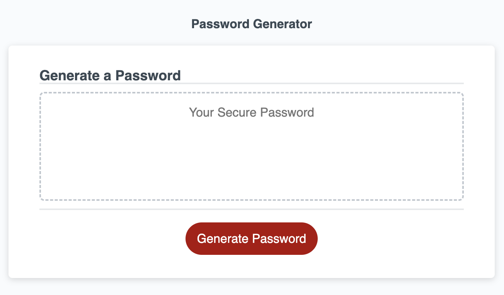
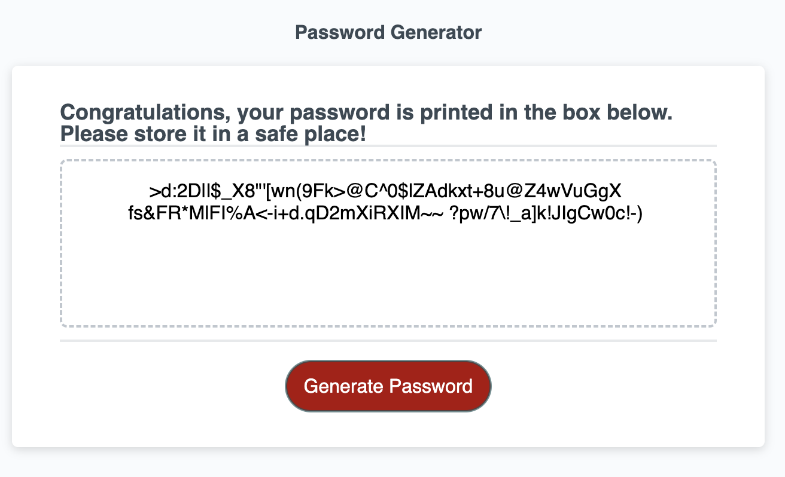

# password-generator
Password Generator Utility 

## Description

Password Generator Utility is an application that an employee can use to generate a random password based on criteria they've selected. This app runs in the browser, and features dynamically updated HTML and CSS powered by JavaScript code.

## Installation

An app is live on Internet and requires to enter and run the following URL from the browser:

https://vasilyl1.github.io/password-generator/

## Usage

An app is prompting the user for the multiple password generation criteria's - such as the lenght of the password and type of symbols and characters allowed. Once the user defines these criteria's, the newly generated password is displayed in the box and the copy of the password is stored in the browser textarea placeholder element.

The two screenshots below feature the starting page and the result of the application:

This is the result once the user defined all the criteria's:

## Credits

N/A

## License

MIT License

Copyright (c) 2022 vasilyl1

Permission is hereby granted, free of charge, to any person obtaining a copy
of this software and associated documentation files (the "Software"), to deal in the Software without restriction, including without limitation the rights to use, copy, modify, merge, publish, distribute, sublicense, and/or sell copies of the Software, and to permit persons to whom the Software is
furnished to do so, subject to the following conditions:

The above copyright notice and this permission notice shall be included in all copies or substantial portions of the Software.

THE SOFTWARE IS PROVIDED "AS IS", WITHOUT WARRANTY OF ANY KIND, EXPRESS OR
IMPLIED, INCLUDING BUT NOT LIMITED TO THE WARRANTIES OF MERCHANTABILITY,
FITNESS FOR A PARTICULAR PURPOSE AND NONINFRINGEMENT. IN NO EVENT SHALL THE
AUTHORS OR COPYRIGHT HOLDERS BE LIABLE FOR ANY CLAIM, DAMAGES OR OTHER
LIABILITY, WHETHER IN AN ACTION OF CONTRACT, TORT OR OTHERWISE, ARISING FROM, OUT OF OR IN CONNECTION WITH THE SOFTWARE OR THE USE OR OTHER DEALINGS IN THE SOFTWARE.